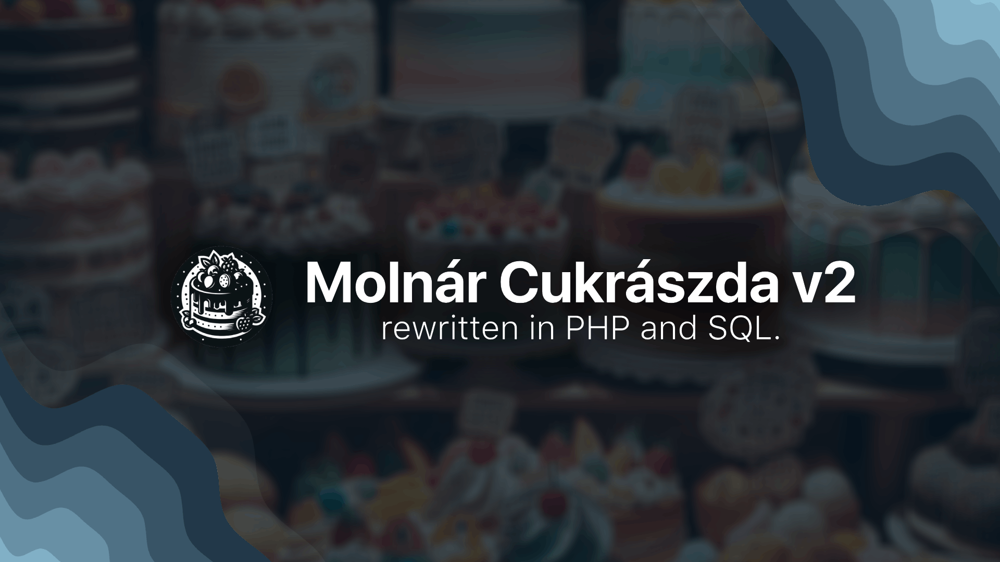

# Molnár Cukrászda

"Molnár Cukrászda" is an online bakery, a figment of creative imagination, showcasing delightful cakes and pastries that exist solely in the digital realm. This website is an inventive culminating project, a fusion of artistic design and the allure of a sweet paradise, despite not being an actual bakery.


> [!NOTE]
> This repository is the 'finished' version of the [molnarcukraszda.hu](https://github.com/matyii/molnarcukraszda.hu) repository. This 'remastered' version contains the back-end of the website and the database.

## Requirements

- Apache (`was tested on version 2.4.25`)
- PHP (`was tested on version 7.1.3`)
- MySQL Server (`was tested on version 5.7.17`)

## How to install
- Clone the repository using `git clone`.
- Import the `.sql` file to the MySQL server.

## Setting up the database
- Replace all the SQL server login credentials with yours in the `modules/database.php` file.
```php
$servername = "localhost";
$username = "root";
$password = "";
$dbname = "molnarcukraszda";
```

## Features

- Pure Bootstrap
- Complete user and order management
- Permission system
- Admin dashboard